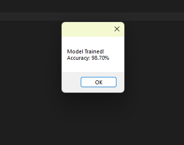
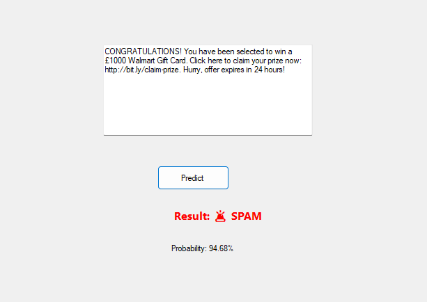
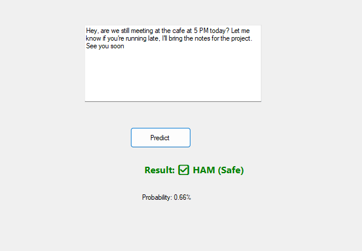

# 📧 Spam Classifier (WinForms + ML.NET + Docker)

## 📌 Project Description

This project is a Spam Message Classifier built using **ML.NET** and a **WinForms application**.
The model classifies messages as **Spam or Ham (Not Spam)** based on text input.

The application provides a simple graphical interface where users can:

* Train the machine learning model
* Enter a message
* Predict whether the message is spam or not

---

## 🧠 Technologies Used

* C# (.NET Framework / .NET)
* ML.NET
* WinForms (GUI)
* Docker (for containerization)

---

## ⚙️ Setup Instructions

### 🔹 1. Run the WinForms Application

1. Open the project in Visual Studio
2. Restore NuGet packages
3. Press **Ctrl + F5** to run
4. Click **Train Model**
5. Enter a message and click **Predict**

---

### 🔹 2. Docker Setup (Demo Purpose)

> Note: WinForms UI cannot run inside Docker (Linux container). Docker is used here to demonstrate build and execution.

#### Build Docker Image

```
docker build -t spam-app .
```

#### Run Docker Container

```
docker run spam-app
```

---

## 🐳 Dockerfile Explanation

### Base Image

```
FROM mcr.microsoft.com/dotnet/sdk:7.0
```

Used as the environment with .NET SDK installed.

### Build Process

```
COPY . .
RUN dotnet build
```

Copies project files and builds the application.

### Run Command

```
CMD ["dotnet", "run"]
```

Runs the application inside the container.

---

## 📊 Dataset

The project uses the **SMS Spam Collection Dataset**.
Messages are labeled as:

* `0` → Ham (Not Spam)
* `1` → Spam
## 📊 Model Performance & Demo

To verify the classifier's reliability, the model was evaluated against a test dataset, achieving high precision in distinguishing between legitimate and malicious intent.

### 📈 Model Accuracy

*The training results showing the accuracy and loss metrics of the ML.NET SDCA trainer.*

---

### 🧪 Live Classification Examples
| 🚩 Spam Detection | ✅ Ham (Legitimate) |
| :--- | :--- |
|  |  |
| *Example of a high-confidence spam alert.* | *Example of a clean, personal message.* |---

## ✅ Conclusion

This project demonstrates how machine learning can be used to classify text messages and how Docker can be used to containerize applications for deployment.

---

## 👨‍💻 Author

Muhammad Harib
